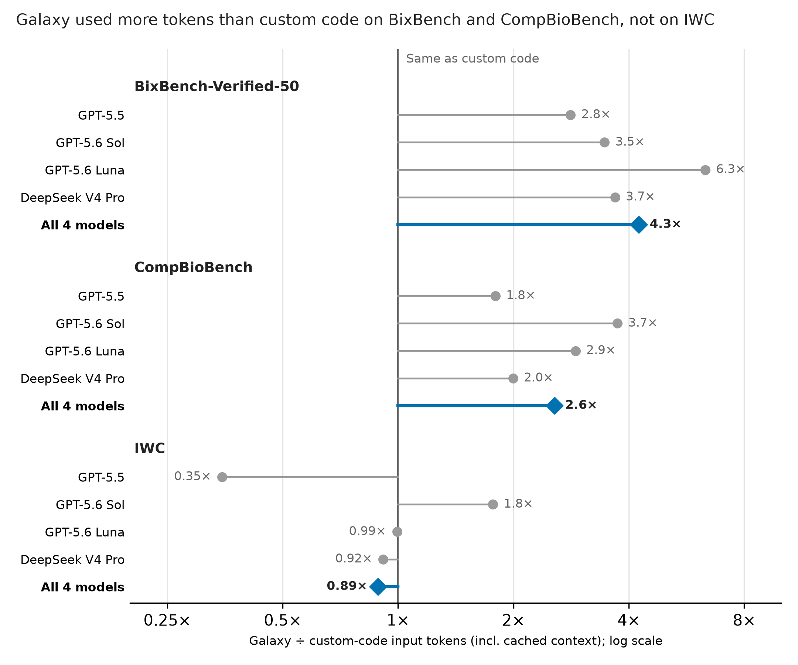
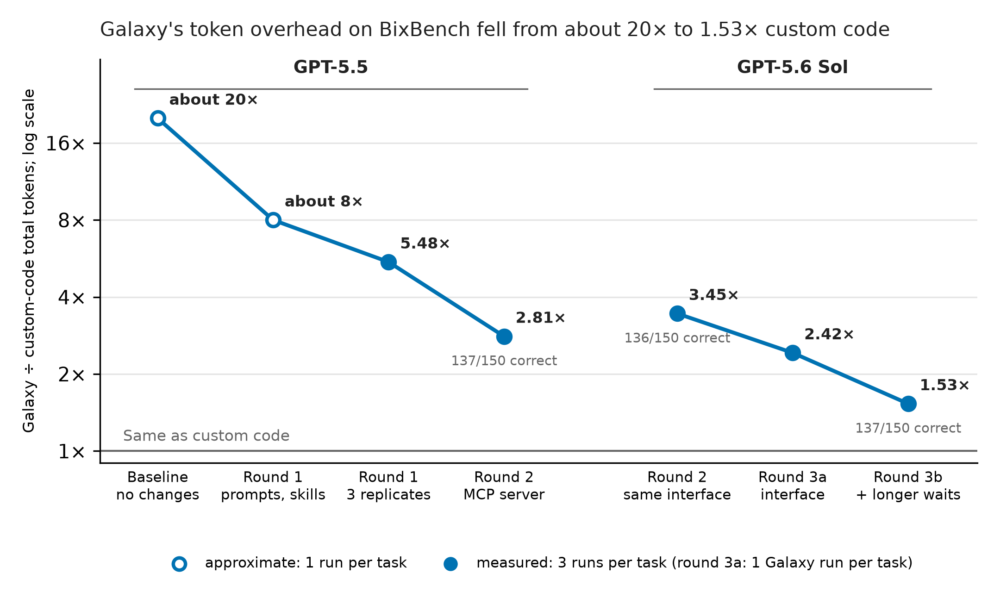

# Agent Token Usage in Galaxy

Exported 2026-10-10 from the Claude Docs page [Agent Token Usage in Galaxy](https://claude.ai/code/artifact/d0f5198e-045f-40c6-80b3-5bcd7514432f), compiled by Jeremy Goecks from Junhao Qiu's notes and the benchmark results site.
The figures are regenerated from code in `figures/`, and every number traces to a table in `data/` (see Sources).

In the main benchmark runs, Galaxy used 4.3× the tokens of custom code on BixBench, 2.6× on CompBioBench and 0.89× on IWC.
Three rounds of interface and prompt changes then cut Galaxy's overhead on BixBench from about 20× to 1.53× custom code, with accuracy unchanged.

## Token use in the main runs

These runs used the round-2 interface (below).
Input tokens are over 98% of the total in every condition, so the input ratio stands for the total.
13 CompBioBench Galaxy runs and 1 custom-code run have no token count and are left out.

On CompBioBench, Galaxy used 13.2 billion input tokens and custom code 5.16 billion, pooled over the four models (2.56×).
These totals come from the run table in PR #12, which includes the 53 reviewed CompBioBench Galaxy reruns of 2026-10-05 in place of the runs they superseded.

## Reducing Galaxy's token overhead

Accuracy held as tokens fell: the round-3b runs were correct on 137 of 150 tasks, against 136 of 150 for the round-2 runs of the same model.

## What changed in each round

Each round targeted one source of overhead, and each was measured by rerunning complete BixBench-Verified-50 runs.
Ratios are Galaxy total tokens ÷ custom-code total tokens for the same tasks and model.

| Round | Model and runs | What changed | Galaxy ÷ custom code |
| --- | --- | --- | --- |
| Baseline | GPT-5.5, 50 tasks, 1 run per task per condition | None | about 20× |
| 1. Prompt and skills | GPT-5.5, same 50 runs per condition | Shorter skill text (for example, the CRISPR skill's repeated explanations of dependency-score direction became one rule). Agents told to save full Galaxy API responses to files and print only summaries (the full tool catalog to `run_trace/all_tools.json`, with only matching tool IDs, names and versions shown), reuse saved tool inventories, inspect only relevant parameters, and stop reprinting histories and logs. Agents did not always follow this guidance. | about 8× |
| 1, rerun with replicates | GPT-5.5, 3 runs per task per condition (150 runs each), 6 July 2026 | Same as round 1 | 5.5× (446.7M vs 81.5M) |
| 2. MCP and execution | GPT-5.5, 150 runs per condition | Routine operations moved into the Galaxy MCP server: one call submits a job, waits for it, checks the resolved inputs and parameters, and returns a compact result. Record keeping and parameter checks became automatic. Live tool search replaced the static tool-catalog skill, and automatic handling replaced the token-efficiency skill. | 2.8× (199.9M vs 71.2M); Galaxy tokens down 55.2% |
| 2, on a newer model | GPT-5.6 Sol, 150 runs per condition (the runs on the results site) | Same as round 2 | 3.45× (122.4M vs 35.5M per 50-task run) |
| 3a. Interface | GPT-5.6 Sol, 1 Galaxy replicate (50 runs) | Shorter replies, capped at 4 KiB per output and 8 KiB per reply. An "unchanged" notice instead of repeating tool parameters. Fill-in parameter templates, fewer false parameter warnings, and checks that catch user-defined tool errors before a job is submitted. | 2.42× (85.9M) |
| 3b. Longer waits | GPT-5.6 Sol, 3 Galaxy replicates (150 runs) | Agents told to wait at least five minutes, preferably thirty, before re-checking a running operation. Waiting calls fell from 481 to 78 per 50-task run, and model requests from 1,799 to 1,332. | 1.53× (54.4M vs 35.5M); 137 of 150 correct |

Junhao Qiu's summary of the lesson: cut both the repeated context and how often the model has to inspect, submit and check operations.
Full requests, responses and job records are still saved for review after every round.

## Where the tokens go

Galaxy's extra tokens came from re-reading context on many round trips, not from reasoning or long answers.
In the 6 July BixBench runs (GPT-5.5, after round 1, 150 runs per condition):

- Cached input, the context the model re-reads on each call, was 95% of Galaxy tokens and 89% of custom-code tokens. Output was under 1.5% in both.
- Galaxy runs took 2.66× as many agent steps (37.9 against 14.2 per run) and 1.90× as many shell commands.
- Each Galaxy step carried 2.2× as much cached context (74.6K against 34.0K tokens).
- Galaxy API work dominated the extra text: platform and API operations produced 18× the visible command text and output of comparable custom-code work.

So cost is roughly the number of round trips times the context carried on each.
Round 1 trimmed context, round 2 removed round trips by moving routine operations into the MCP server, and round 3 did both.

## Caveats and open questions

The rounds are a sequence of improvements, not a controlled ablation, so compare ratios within a row rather than across rows.

- The model changed between rounds 2 and 3 (GPT-5.5 to GPT-5.6 Sol), and the model alone moves the ratio: with the same round-2 interface, it was 2.8× for GPT-5.5 and 3.45× for GPT-5.6 Sol.
- The baseline and round 1 used one run per task; later rounds used three replicates.
- Round 2 reran both conditions, so its custom-code baseline also changed (81.5M to 71.2M tokens). Round 3 reran Galaxy only and reused the existing custom-code runs.
- Round 3 used a newer Codex CLI (0.156.0 against 0.146.0).
- Savings were not measured separately for each change within a round.
- The main benchmark runs, including CompBioBench and IWC, use the round-2 interface; round 3 is a supplementary batch on BixBench only.

Open questions:

- The baseline has been quoted as about 13×, 18× and 20× in discussion; Junhao Qiu's measured figure is about 20×. The baseline and round-1 runs are not on the results site, so their run records are needed to confirm both figures.
- The round totals in `data/token_optimization_rounds.csv` are transcribed from the results site and Junhao Qiu's notes, not computed from run records in this repository.

## Sources

- `data/token_ratios_main_runs.csv`, written by `analysis/token_usage.py` from `data/run_tokens_actions.csv` (added in [PR #12](https://github.com/goeckslab/agent-galaxy-benchmark-manuscript/pull/12)): main-run input tokens per benchmark and model.
- `data/token_optimization_rounds.csv`: the round totals, one source per row, and `data/token_optimization_ratios.csv`, written by `analysis/token_usage.py`, with each round's ratio.
- Junhao Qiu's notes on the three optimization rounds (Slack, October 2026): changes made, the about-20× baseline, and the round-1 and round-3a figures.
- [BixBench token usage by model](https://github.com/goeckslab/galaxy-agent-benchmark/blob/main/site/bixbench/tokens/index.html) (results site): round-2 totals and accuracy for GPT-5.5 and GPT-5.6 Sol.
- [BixBench 6 July token drivers](https://github.com/goeckslab/galaxy-agent-benchmark/blob/main/site/bixbench/july6/token-drivers/index.html) (results site): the 5.5× rerun and where the tokens go.
- [Third-round token optimization](https://github.com/goeckslab/galaxy-agent-benchmark/blob/main/site/bixbench/token-optimization-oct2026/index.html) (results site) and its [README](https://github.com/goeckslab/galaxy-agent-benchmark/blob/main/bixbench/results/token_optimization_oct2026/README.md): round-3 runs; tokens are input plus output, with cached input counted once.
